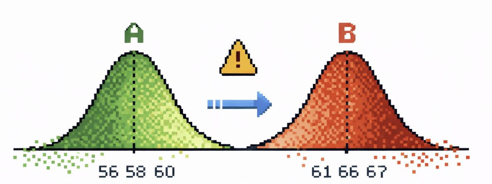

나는 메모리 반도체*(특히 Nand Flash)*를 평가하고 분석하는 팀에 있다. 정말 말 그대로 반도체를 만들고나면 고객에게 반도체를 팔기위해 여러 Test를 한다. 여기서 많이들 들어봤을 **수율**이라는 개념이 나온다.

이때, 정말 많은 데이터들이 나오는데 나는 이 평가를 하며 나오는 **모든 데이터**를 통계적인 시각에서 보는 그룹에 속해있다. EDS 같은 전기적 테스트 데이터, Chip 수준 품질 지표, Nand의 Block 패턴처럼 Wafer와 Chip에서의 벌어지는 일을 드러내는 신호 데이터들이 주요 대상이다. 이 데이터는 물량 선별*(Wafer와 Chip의 Tier를 매긴다. 마치 Regression/Inference)*, 물량 공급 판단, 불량 대응 같은 업무에도 쓰이고, 기존 조건의 데이터와 새로운 개발 물량의 새로운 조건에서의 데이터를 비교하는 리뷰 업무도 진행한다.

{width="300"}

## 1. Data Review Board

다른 데이터 조직과 마찬가지로 이곳에서도 AB-Test를 진행한다. 공정이 바뀌었거나 생산 설비라인을 바꾼다거나.. 모든 것은 돈이기에 함부로 진행할 수는 없다. 모두 Risk를 확인해보아야한다. 우리 데이터 그룹은 이 과정에서 Test에서 나오는 모든 데이터를 비교해보는 업무를 통해 Risk를 확인한다. 우리 데이터 그룹에서는 이런 리뷰 업무의 한 축을 Data Review Board(DRB)라고 부른다. 이름은 좀 거창하지만, 실무 질문은 사실 심플하다. **새 조건이 기준 조건에서 의미 있게 벗어났는가?**

{width="347"}

조금 더 풀어 쓰면 이렇다. reference는 우리가 이미 충분히 성격과 Risk를 파악한 기준 물량이고, target은 새 공정이든 설비이든, 어쨌든 Total 리뷰가 필요한 집단이다. DRB에서 해야 하는 일은 둘의 차이를 숫자로 보고, 그 차이가 실제로 엔지니어가 신경 써야 할 수준인지 판단하여 이슈하는 것이다.

이 지점에서 DRB는 품질 리뷰이면서 동시에 통계 문제이기도 하다. 기준선이 있고, 비교 대상이 있고, 평균이 달라질 수 있고, 산포도 달라질 수 있고, 마지막에는 이걸 받아들일지 말지를 결정해야 한다. 아주 실무적인 일처럼 보이지만, 뼈대를 벗겨 보면 꽤 정통 통계 문제다.

> 여기서 사실 반도체 공정 데이터만이 가지고있는 특성들도 당연히 있다. 1. Spatial 2. 표본 모으기가 정말 힘들다 / IT 플랫폼처럼 아름답고도 많은 비교군 대조군을 형성하기 힘들다. 돈이 정말 많이 든다. 이러한 특성 하에서도 생각할 거리가 많다.

## 2. 이거, 어디서 많이 봤다... Two-Sample Test다!

이 구조, 어디서 많이 봤는데? 🤔

{width="150"}

Reference와 Target, 두 집단 비교, 평균 차이, 변동성, 판단. 결국 뼈대만 보면 Two-Sample Test, 넓\~게 말하면 AB-Test다. 물론 우리가 하는 일은 전형적인 프로덕트 실험과는 다르다. 거기서는 보통 “두 집단이 다른가?”가 중심 질문이지만, 여기서는 “타깃이 기준선에서 얼마나 이탈했는가?”가 더 중요하다. 그래도 통계적 골격 자체는 분명 익숙하다.

이상했다. Textbook에서 보던 도구들이 당연히 중심에 있을 거라고 생각했다. T-Test, P-Value, Pooled Standard Deviation을 이용한 Standardized Difference 같은 것들 말이다. 실제로 Standardized Mean Difference는 원래 두 집단 비교에서 널리 쓰이는 효과크기 지표이고, 정규·등분산 상황에서는 해석도 가장 자연스럽다.

$$d = \frac{\mu_{\text{target}} - \mu_{\text{reference}}}{\sigma_{\text{pooled}}}$$

where

$$\left( \sigma_{\text{pooled}} = \sqrt{\frac{(n_T - 1)\sigma_{\text{target}}^2 + (n_R - 1)\sigma_{\text{reference}}^2}{n_T + n_R - 2}} \right)$$

문제는 DRB의 질문이 애초에 그 교과서적 상황과 완전히 같지는 않다는 점이다. 우리에게 Reference는 그냥 “비교군 A”가 아니라 기준선이고, Target은 평균만 바뀌는 집단이 아니라 산포까지 흔들릴 수 있는 리뷰 대상이다.

## 3. 기존 접근: 이름은 없지만 모두가 쓰던 지표

### 우리는 Pooled SD를 쓰지 않았다

하루하루 반복적인 업무를 하다보니 어느 순간 이런 생각이들었다. **“잠깐, 엥? 우리 왜 이 지표를 이렇게 쓰지?”**

데이터 그룹 현업에서 모두가 그냥 쓰던 지표를 다시 봐봤다. 분모가 예상과 달랐다. 두 집단의 변동성을 합쳐 쓴 pooled SD가 아니라, 오직 Reference 집단의 표준편차만 들어가 있었다. 정식 이름을 붙여 설명하는 사람은 거의 없었지만, 다들 그 지표를 그냥 썼다. 이유를 물어보면 돌아오는 답은 통계적인 답이 아니었다. 완전히 현업 언어였다. “Target 조건의 산포가 튀면, 그걸 분모에 섞는 순간 점수가 좀.. 직아집니다. 놓치는 지수들이 생겨요.”

이 말은 그냥 정확하다. Target이 불안정해졌다면, 그 불안정성은 우리가 풀어야 하는 문제의 일부다. 그런데 그 Noisy함을 분모에 함께 넣어버리면, 오히려 변화가 덜 심각해 보일 수 있다. 엔지니어 입장에서는 찝찝하다.

수학과 출신인 나에게 이 지표는 “이름 없는 관습”이 아니라 “뭔가 통계학적으로 정체가 있을 것 같은 지표”처럼 보이기 시작했다.

## 4. 사내 지표를 역설계해 보니 Glass’s Delta였다

집에 와서 AI들과 함께 살짝 더 파고들어 보니, 이 사내 지표는 사실 이미 통계학에 이름이 붙어 있었다. 바로 **Glass’s Delta**다.

$$\Delta_{\text{Glass}} = 
\frac{\mu_{\text{target}}-\mu_{\text{reference}}}{\sigma_{\text{reference}}}$$

Glass’s Delta는 Control 또는 Reference 그룹의 표준편차를 분모로 쓰는 효과크기다. 반면 Cohen류의 익숙한 Standardized Mean Difference는 보통 두 집단의 Pooled Standard Deviation을 쓴다. 즉, 겉보기엔 “분모를 어떻게 둘까”의 문제처럼 보여도, 실제로는 무슨 잣대로 변화를 재고 있느냐의 문제다. Glass가 Control/Reference 쪽 SD를 쓰는 이유도, 여러 Treatment가 Control과 비교될 때 Control Variability를 기준 잣대로 두고 싶다는 데 있었다.

여기서 재미있는 건 우리가 새로운 통계를 현장에 가져온 게 아니라는 점이다. 오히려 반대다. 현업 엔지니어들은 이미 이름 없이 그 논리를 쓰고 있었다. Baseline은 기준선으로 남아야 하고, Target의 불안정성이 다름의 크기를 덜 커 보이게 만들어서는 안 된다는 감각. 통계학은 거기에 뒤늦게 명찰을 달아줬을 뿐이다.

이런 의미에서 진짜 발견은 “Glass’s Delta라는 희귀한 지표를 찾았다”가 아니다. 반도체 데이터 리뷰 Workflow 안에, 이미 Glass’s Delta의 문제의식이 숨어 있었다는 점이 흥미롭다.

## 5. Small Simulation

직관을 위해 아주 단순한 시뮬레이션을 생각해보자. 기준 집단(reference)은 안정적인 공정을 나타낸다고 보고, 평균 100, 표준편차 1인 정규분포에서 생성한다. 반면 비교 집단(target)은 평균이 105로 이동했지만 동시에 훨씬 더 noisy해진 상황을 가정하여, 평균 105, 표준편차 8인 정규분포에서 생성한다.

$$X_{\text{reference}} \sim \mathcal{N}(100, 1^2)$$

$$X_{\text{target}} \sim \mathcal{N}(105, 8^2)$$

이 설정에서 평균 차이(mean difference)는 약 5로 비교적 크다. 중요한 점은, 이 차이를 어떤 표준편차로 나누느냐에 따라 effect size의 해석이 크게 달라진다는 것이다.

Glass’s Delta는 기준 집단의 표준편차만을 분모로 사용한다. 따라서 이 예시에서는 대략

$$\Delta_{\text{Glass}} \approx \frac{105 - 100}{1} = 5$$

가 된다. 즉, 안정적인 baseline의 관점에서 보면 target은 기준 상태로부터 매우 크게 벗어난 것이다.

반면 Cohen’s d는 두 집단의 정보를 합친 pooled standard deviation을 분모로 사용한다. 그런데 여기서는 target 집단의 분산이 매우 크므로, pooled SD 자체가 크게 증가한다. 그 결과 같은 평균 차이를 사용하더라도 effect size는 크게 줄어들며, 실제로 1보다 작은 값으로 떨어질 수 있다. 다시 말해, target의 불안정성이 분모에 흡수되면서 shift 자체가 희석되는 것이다.

```{r}
#| echo: true
#| code-fold: true
#| code-summary: "👀 Updated Simulation & Plotting Code"
#| warning: false
#| message: false

library(data.table)
library(ggplot2)
library(grid)

# ==============================================================================
# 1. Data Generation
# ==============================================================================
set.seed(2026)
n <- 200L

dt <- rbindlist(list(
  data.table(Group = "A: Control (Stable Baseline)", Value = rnorm(n, mean = 100, sd = 1)),
  data.table(Group = "B: Treatment (Shifted + Noisy)", Value = rnorm(n, mean = 105, sd = 8))
))

group_levels <- c("A: Control (Stable Baseline)", "B: Treatment (Shifted + Noisy)")
dt[, Group := factor(Group, levels = group_levels)]
dt[, x := fifelse(Group == group_levels[1], 1, 2)]

# ==============================================================================
# 2. Statistics
# ==============================================================================
stats <- dt[, .(
  n = .N,
  Mean = mean(Value),
  SD_Own = sd(Value)
), by = .(Group, x)]

mean_A <- stats[Group == group_levels[1], Mean]
mean_B <- stats[Group == group_levels[2], Mean]

sd_ref <- stats[Group == group_levels[1], SD_Own]
sd_pooled <- with(stats, sqrt(sum((n - 1) * SD_Own^2) / sum(n - 1)))

mean_diff <- mean_B - mean_A
glass_val <- mean_diff / sd_ref
cohen_val <- mean_diff / sd_pooled

flag_glass <- as.integer(glass_val >= 1)
flag_cohen <- as.integer(cohen_val >= 1)

# ==============================================================================
# 3. Ruler data 
# ==============================================================================
ruler_dt <- data.table(
  type   = c("1 Ref SD", "1 Pooled SD"),
  x      = c(3, 3.3), 
  center = mean_A,
  ymin   = c(mean_A - sd_ref,    mean_A - sd_pooled),
  ymax   = c(mean_A + sd_ref,    mean_A + sd_pooled),
  col    = c("#0072B2", "#D55E00")
)

y_min <- min(dt$Value) - 3
y_max <- max(dt$Value) + 3

label_txt <- paste0(
  "Mean Diff = ", round(mean_diff, 2), "\n",
  "Glass's \u0394 = ", round(glass_val, 2), "   \u2192 Alarm = ", flag_glass, "\n",
  "Cohen's d = ", round(cohen_val, 2), "   \u2192 Alarm = ", flag_cohen
)

# ==============================================================================
# 4. Plot
# ==============================================================================
ggplot(dt, aes(x = x, y = Value)) +
  
  geom_point(
    aes(fill = Group),
    position = position_jitter(width = 0.35, height = 0, seed = 2026),
    shape = 21, size = 2.9, stroke = 0.28,
    color = "grey15", alpha = 0.82
  ) +
  
  geom_segment(
    data = stats,
    aes(x = x - 0.20, xend = x + 0.20, y = Mean, yend = Mean),
    inherit.aes = FALSE,
    linewidth = 1.3, color = "black"
  ) +
  
  geom_point(
    data = stats,
    aes(x = x, y = Mean),
    inherit.aes = FALSE,
    shape = 23, size = 4.5,
    fill = "white", color = "black", stroke = 1.1
  ) +
  
  annotate(
    "segment",
    x = 2.25, xend = 2.25,
    y = mean_A, yend = mean_B,
    arrow = arrow(length = unit(0.18, "cm"), ends = "both"),
    linewidth = 1.0, color = "black"
  ) +
  annotate(
    "text",
    x = 2.30, y = (mean_A + mean_B) / 2,
    label = paste0("Mean diff\n", round(mean_diff, 2)),
    hjust = 0, size = 4.2, fontface = "bold"
  ) +
  
  geom_linerange(
    data = ruler_dt,
    aes(x = x, ymin = ymin, ymax = ymax, color = type),
    inherit.aes = FALSE,
    linewidth = 2.3, lineend = "round"
  ) +
  geom_point(
    data = ruler_dt,
    aes(x = x, y = center, color = type),
    inherit.aes = FALSE,
    size = 3.3
  ) +
  
  # === 포인트 3: 글자 위아래 조절 ===
  # + 2.5 라는 숫자를 조절해보세요.
  annotate(
    "text",
    x = 3, y = mean_A + sd_ref + 3.7, 
    label = paste0("1 Ref SD\n(", round(sd_ref, 2), ")"),
    color = "#0072B2", fontface = "bold", size = 4.1
  ) +
  annotate(
    "text",
    x = 3.3, y = mean_A + sd_pooled + 3.7,
    label = paste0("1 Pooled SD\n(", round(sd_pooled, 2), ")"),
    color = "#D55E00", fontface = "bold", size = 4.1
  ) +
  
  # === 포인트 2: 투명 배경 & 글자 크기 ===
  # fill = NA (배경 투명), label.size = 0 (테두리 삭제)
  annotate(
    "label",
    x = 1.5, y = y_max,
    label = label_txt,
    size = 3.8, fontface = "bold",
    fill = alpha("white", 0.5),  # 흰색 배경에 50% 투명도 적용
    color = "black",
    label.size = 0, 
    vjust = 1
  ) +
  
  scale_fill_manual(values = c(
    "A: Control (Stable Baseline)" = "#BFD7EA",
    "B: Treatment (Shifted + Noisy)" = "#F6C5AF"
  )) +
  scale_color_manual(values = c(
    "1 Ref SD"    = "#0072B2",
    "1 Pooled SD" = "#D55E00"
  )) +
  scale_x_continuous(
    breaks = c(1, 2),
    labels = c("A: Control\n(Stable Baseline)", "B: Treatment\n(Shifted + Noisy)")
  ) +
  
  # === 포인트 1: 오른쪽 텅 빈 공간(여백) 조절 ===
  # xlim의 끝값(3.95)을 조절해보세요.
  coord_cartesian(
    xlim = c(0.65, 3.20), 
    ylim = c(y_min, y_max),
    clip = "off"
  ) +
  labs(
    title = "Same Mean Difference, Different Rulers",
    subtitle = "While large when measured by the Control SD,\nusing the Pooled SD inflates the 'ruler' due to the Treatment's variance,\ndiluting the signal.",
    x = NULL,
    y = "Metrology Value"
  ) +
  theme_minimal(base_size = 14) +
  theme(
    legend.position = "none",
    panel.grid.major.x = element_blank(),
    panel.grid.minor.x = element_blank(),
    axis.text.x = element_text(face = "bold", size = 12, color = "black"),
    plot.title = element_text(face = "bold", size = 17),
    plot.subtitle = element_text(size = 12),
    # plot.margin의 두 번째 숫자(90)를 조절해보세요.
    plot.margin = margin(15, 90, 15, 15)
  )
```

위 그림은 이 점을 시각적으로 보여준다. 파란 막대는 기준 집단의 표준편차(Ref SD)를, 빨간 막대는 pooled standard deviation을 나타낸다. 같은 평균 차이임에도 불구하고 어떤 자(ruler)를 쓰느냐에 따라 signal의 크기가 전혀 다르게 보인다. 기준 집단의 자로 보면 분명한 이동이지만, pooled 자로 재면 noisy target의 분산 때문에 그 이동이 작아 보이게 된다.

## 6. 가벼운 수학적 해석

핵심은 당연하게도 분모에 있다. 분모가 곧 비교의 의미를 정한다.

두 집단이 정규분포를 따르고 분산도 같다면, pooled standard deviation으로 표준화한 효과크기는 아주 자연스럽다. Standardized mean difference(Cohen's $d$)가 분포의 겹침(Overlap)이나 통계적 직관과 1:1로 예쁘게 연결되는 것도 딱 이 조건에서다. 하지만 현업 데이터처럼 **분산이 다를 수 있다면** 이야기가 완전히 달라진다. 그 순간 Pooled-SD 계열과 Reference-anchored 계열(Glass's $\Delta$)은 더 이상 같은 대상을 재고 있지 않다.

Larry V. Hedges의 리뷰 논문(Hedges, 2024)은 이 지점을 아주 명확하게 짚어낸다. 해당 논문에 따르면, 이분산(Heteroscedasticity) 상황에서 효과크기를 해석할 때, 두 분산을 어떤 가중치($w$)로 섞어 쓸지 결정하는 순간부터 특정 집단이 다른 집단을 넘어설 확률(예: $U_3$ 비겹침 지수)과의 수학적 연결고리가 어긋나기 시작한다. 즉, 평균 이동 폭이 완전히 동일하더라도 '어떤 표준화 방식(분모)을 선택하느냐'에 따라 데이터의 중첩 정도나 실질적인 효과에 대한 해석이 완전히 왜곡될 수 있음이 수리적으로 증명된 것이다.
[링크](https://pmc.ncbi.nlm.nih.gov/articles/PMC11562970/?utm_source=chatgpt.com)
`여기 다듬기`

간단히 확인해 보자. Reference와 Target의 평균 차이는 $\mu_{\text{target}} - \mu_{\text{reference}}$로 고정되어 있다고 치자. 여기서 Target의 분포가 흔들려, 표준편차가 Reference의 $k$배가 되었다고 가정하자.

$$\sigma_{\text{target}} = k \cdot \sigma_{\text{reference}}$$

두 집단의 표본 크기가 비슷하다면, Pooled SD는 대략 다음과 같이 두 분산의 성격을 반씩 섞은 가상의 잣대가 된다.

$$s_{\text{pooled}} \approx \sigma_{\text{reference}} \sqrt{\frac{1+k^2}{2}}$$

이 잣대를 사용하여 Pooled effect size를 구해보면, Glass's $\Delta$와 다음과 같은 관계식이 도출된다.

$$d_{\text{pooled}} = \frac{\mu_{\text{target}}-\mu_{\text{reference}}}{s_{\text{pooled}}} = \Delta_{\text{Glass}} \cdot \frac{1}{\sqrt{(1+k^2)/2}}$$

이 식이 말하는 바는 아주 직설적이다.평균 이동이 원래 목표대로 완벽하게 고정되어 있어도, Target의 산포가 기준치보다 커지는 순간 ($k>1$) 우변의 분모가 커지면서 Pooled effect size는 강제로 깎여나간다. Target이 불안정하여 산포가 튀면 튈수록 점수는 점점 더 작아져, 마치 평균 이동 자체가 미미했던 것처럼 착시를 일으킨다. 현장 엔지니어들이 찝찝해하며 말하던 “Target 산포 튄 걸 분모에 섞으면 점수가 이상해진다”를 확인해보았다. 이건 단순히 "어떤 지표를 쓸까?" 하는 취향의 문제가 아니다. Pooled SD라는 분모가 억지로 만들어내는 강력한 **Attenuation Mechanism(희석 기제)**이다. 우리는 그동안 이 수식의 왜곡을 직감적으로 피해서 Reference의 흔들리지 않는 잣대, Glass's $\Delta$를 쓰고 있었던 거다.

`여기에 그래프 하나넣으면좋을듯`

## 7. 한계와 다음 질문

위에

------------------------------------------------------------------------

# Appendix

여기서는 석사 수리통계 경험을 살려 좀 깊게? (이거 나도 공부가 많이 될 듯)

중간중간내가 읽어보면서 글이랑 매끄럽게 이어지도록 그럼 좀 더 넣자!


## Appendix A. 문제의 수학적 설정 (Population Parameters)

Reference 표본을 $R_1,\dots,R_m$, Target 표본을 $T_1,\dots,T_n$이라 하자. 가장 기본적인 Data Generating Process(DGP)는 다음과 같이 설정할 수 있다.

$$R_i \overset{iid}{\sim} N(\mu_R, \sigma_R^2), \qquad T_j \overset{iid}{\sim} N(\mu_T, \sigma_T^2)$$

두 표본은 서로 독립이다. 이때 모집단 수준의 순수 평균 이동(Raw mean shift)은 $\Delta_\mu = \mu_T - \mu_R$이다.

만약 완벽한 등분산($\sigma_R = \sigma_T = \sigma$) 상황이라면, 모집단 효과크기는 $\delta = \frac{\mu_T - \mu_R}{\sigma}$로 유일하게 정의되며, 이것이 Standardized Mean Difference가 기하학적(분포의 중첩)으로 가장 자연스럽게 해석되는 조건이다. 

그러나 반도체 제조 공정처럼 새로운 조건(Target)에서 산포의 변동이 필연적으로 수반되는 경우, 우리가 추정해야 하는 진정한 모수(Parameter of interest)는 "Baseline variability 단위로 평가한 평균의 이동"이다. 즉, Glass's Delta의 모집단 모수는 다음과 같이 정의된다.

$$\Delta_G = \frac{\mu_T - \mu_R}{\sigma_R}$$

여기서 핵심은 "어떤 추정량(Estimator)이 더 우수한가"를 논하기 전에, **"우리가 풀고자 하는 물리적 현상이 어느 모수(Parameter)에 매핑되는가"**를 명확히 하는 것이다.

## Appendix B. Attenuation Mechanism의 해석적 증명

Target의 표준편차가 Reference의 $k$배라고 하자 ($\sigma_T = k\sigma_R$). 
표본 크기가 $m, n$일 때, Pooled SD의 모집단 아날로그(Population analogue)는 가중 평균에 의해 다음과 같이 근사된다.

$$\sigma_{\text{pooled}} \approx \sigma_R \sqrt{\frac{(m-1) + (n-1)k^2}{m+n-2}}$$

따라서 Pooled Standardized Difference는 다음과 같은 관계를 갖는다.

$$d_{\text{pooled}} \approx \frac{\mu_T - \mu_R}{\sigma_{\text{pooled}}} = \Delta_G \left[ \frac{(m-1) + (n-1)k^2}{m+n-2} \right]^{-1/2}$$

특히 실무 AB-Test처럼 표본 크기가 엇비슷한 경우($m \approx n$), 위 식은 다음과 같이 단순화된다.

$$d_{\text{pooled}} \approx \Delta_G \cdot \frac{1}{\sqrt{(1+k^2)/2}}$$

이 식의 거동을 확인하기 위해 Target 산포의 인플레이션 비율인 $k$에 대해 편미분하면 다음과 같다. (단, $k>0, \Delta_G>0$ 가정)

$$\frac{\partial d_{\text{pooled}}}{\partial k} = -\Delta_G \cdot \frac{\sqrt{2}\,k}{(1+k^2)^{3/2}} < 0$$

도함수가 항시 음수라는 것은, Target variance inflation($k$)이 커질수록 Pooled score가 **단조감소(Monotonically decreasing)**함을 의미한다. 즉, Pooled standardization은 분모의 선택만으로 Mean shift라는 Signal을 억압(Attenuation)하는 수학적 필터로 작동하게 된다.

## Appendix C. 추정량 $\widehat{\Delta}_G$의 표본 분포와 Small-Sample Bias

실무에서는 모수 $\Delta_G$를 알 수 없으므로, 표본 통계량 기반의 추정량 $\widehat{\Delta}_G = \frac{\bar{T} - \bar{R}}{S_R}$을 사용한다. 
정규성과 독립성 가정 하에, 분자(평균 차이)와 분모(Reference 표준편차)의 분포는 다음과 같다.

$$\bar{T} - \bar{R} \sim N\left(\mu_T - \mu_R, \frac{\sigma_T^2}{n} + \frac{\sigma_R^2}{m}\right)$$
$$\frac{(m-1)S_R^2}{\sigma_R^2} \sim \chi^2_{m-1}$$

또한 $\bar{T}-\bar{R}$와 $S_R$은 독립이다. 
이제 상수 $c^2 = \frac{\sigma_T^2}{n} + \frac{\sigma_R^2}{m}$, 자유도 $\nu = m-1$, 비중심성 모수(Noncentrality parameter) $\lambda = \frac{\mu_T - \mu_R}{c}$라 정의하면, 표본 Glass 추정량은 다음과 같이 Scaled Noncentral $t$-분포로 표현된다.

$$\widehat{\Delta}_G \overset{d}{=} \frac{c}{\sigma_R} \cdot t_\nu(\lambda)$$

이 구조적 표현이 시사하는 바는 치명적이다. 
첫째, $\widehat{\Delta}_G$의 기댓값은 $t$-분포의 특성상 모수 $\Delta_G$와 정확히 일치하지 않으며, 특히 Reference 표본 크기($m$)가 작을 때 상향 편향(Upward bias)을 갖는다. 
둘째, 이 편향을 제거하기 위해 Hedges의 보정 계수 $J(\nu)$를 도입한 Unbiased Estimator를 고려해야 한다.

$$J(\nu) = \frac{\Gamma(\nu/2)}{\sqrt{\nu/2} \, \Gamma((\nu-1)/2)}$$
$$\widehat{\Delta}_{G,\text{adj}} = J(\nu)\widehat{\Delta}_G$$

실무 대용량 데이터에서는 $J(\nu) \approx 1 - \frac{3}{4\nu-1} \approx 1$로 수렴하여 무시할 수 있지만, 특정 웨이퍼(Wafer) 단위의 소표본 분석에서는 분모의 불확실성을 통제하기 위해 반드시 이 보정이 수반되어야 한다.

## Appendix D. Welch's t-test와 Glass’s Delta의 수리적 결합과 분리

종종 제기되는 "이분산이면 Welch's t-test를 쓰면 되지 않나?"라는 질문은 통계적 추론(Inference)과 효과크기(Effect Size)의 목적 함수를 혼동한 결과다.

Welch's t-statistic은 평균 차이를 '표본 추출의 불확실성(Sampling uncertainty)'으로 나눈 값이다.

$$t_W = \frac{\bar{T} - \bar{R}}{\sqrt{S_T^2/n + S_R^2/m}}$$

반면 표본 Glass's Delta는 '기준선의 물리적 변동성(Baseline variability)'으로 나눈 값이다. 두 지표는 다음과 같은 대수적 관계를 갖는다.

$$\widehat{\Delta}_G = t_W \cdot \frac{\sqrt{S_T^2/n + S_R^2/m}}{S_R}$$

이 수식은 두 지표가 경쟁 관계가 아님을 증명한다. Welch's $t_W$는 "이 차이가 통계적으로 유의미한가?"를 묻는 신호 대 잡음비(SNR)이고, Glass's $\Delta_G$는 "엔지니어링 관점에서 이 변화가 얼마나 거대한가?"를 묻는 절대적 스케일이다.

## Appendix E. Mean Shift와 Spread Shift의 2차원 직교 분해

결과적으로 단일 지표 하나로 이분산 상황의 DGP를 완벽히 묘사할 수는 없다. 
따라서 DRB(Data Review Board) 대시보드 설계 시, 평균 이동과 산포 변동을 직교(Orthogonal)하는 두 개의 축으로 분리하여 평가하는 것이 가장 수리적으로 안전한 접근이다.

산포의 변동을 측정하는 동반 지표(Spread companion metric)로 로그 분산비(Log Variance Ratio)를 정의할 수 있다.

$$V = \log\left(\frac{S_T}{S_R}\right)$$

이 로그 변환은 비율의 비대칭성을 교정하며, 중심극한정리에 의해 정규분포로의 근사가 용이하다는 해석적 이점을 갖는다.
이를 통해 $(\widehat{\Delta}_G, V)$의 2차원 위상 평면을 구축하면, 평균은 정상이지만 산포가 붕괴된 불량($V \gg 0$)과, 산포는 유지된 채 조건만 이동한 정상적 Shift($\widehat{\Delta}_G > 0, V \approx 0$)를 단일 구조 내에서 수학적으로 분리해 낼 수 있다.